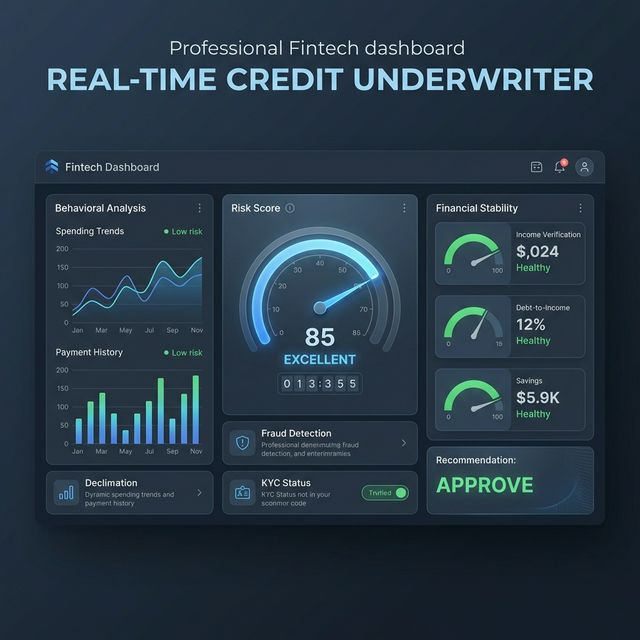
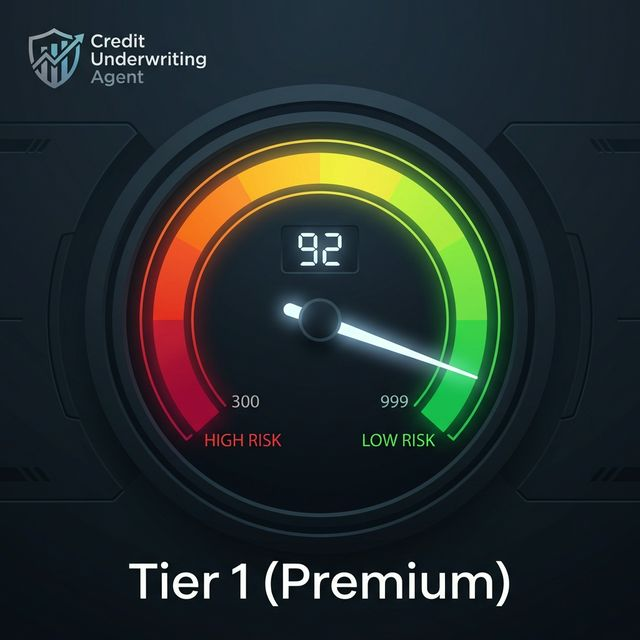
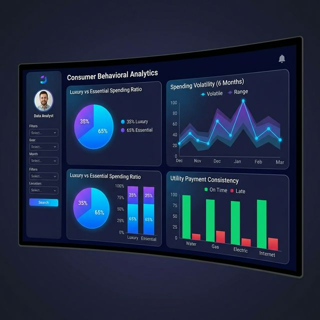

# 💳 Real-Time Credit Underwriting Agent



[](https://www.python.org/)
[](https://nicegui.io/)
[](https://www.sqlite.org/)

**Goal:** An elite, portfolio-ready system that replaces legacy credit scoring with **AI Agentic Reasoning** and **Quantitative Risk Modeling**.

## 🚀 Key Features

*   **🤖 Multi-Agent Logic**: Separate agents for Data Aggregation, Behavioral Analysis, and Senior Underwriting.
*   **📊 Interactive Dashboard**: A premium **NiceGUI** web interface (100% Python) for real-time assessments and visual analysis.
*   **📈 Hybrid Risk Model**: Combines qualitative AI reasoning with a mathematical 0-100 risk score. ([Read the Feature Engineering Docs](docs/feature_engineering.md))
*   **📄 Professional PDF Audits**: Export decision summaries as branded, professional PDF reports.
*   **🗄️ SQL Data Layer**: Move beyond flat files with a structured **SQLite** database (`data/credit_data.db`).
*   **💰 100% Free Tier**: Includes a standalone simulator to demonstrate the full logic without any API keys.

## 📸 Interface Preview

| Risk Scoring | Behavioral Analytics |
| :---: | :---: |
|  |  |

## 🎥 Live Demo

[](#link-to-your-demo-video-here)
> *A live walkthrough of the AI Agent generating a credit decision in real-time. In the competitive tech market, presenting a live dashboard is a massive differentiator.*

## 📂 Project Structure

```text
├── src/
│   ├── agents/          # Specialized Agent Definitions
│   ├── tools/           # Custom Financial Tools (CSV/SQL Support)
│   ├── utils/           
│   │   ├── simulator.py # Free-tier Logic
│   │   ├── scoring.py   # 0-100 Mathematical Score
│   │   └── report_gen.py # PDF Generator
│   └── dashboard.py     # INTERACTIVE WEB UI (NiceGUI)
├── scripts/             # Build and Test Scripts (build_native.py)
├── docs/                # Project Documentation & SQL Portfolio
├── assets/              # README Visuals & Assets
├── data/                # SQLite & CSV Data Sources
├── outputs/             # Generated PDF Audit Folders
└── main.py              # CLI Entry Point
```

## 🚥 Installation & Setup

1. **Install Dependencies**:
   ```bash
   pip install -r requirements.txt
   ```

2. **Initialize Data**:
   ```bash
   python src/utils/setup_mock_data.py
   ```

3. **Choose Your Mode**:
   - **CLI Mode**: `python main.py` (Simple text-based assessment)
   - **Dashboard Mode**: `python src/dashboard.py` (Full Premium UI)

## 📊 How it Works

When you run the **Dashboard**:
1. Select a **User ID** (1-50) from the applicant list.
2. Click **Initialize AI Audit**.
3. The **Data Aggregator** pulls SQL records; the **Analyst** calculates spending volatility.
4. The **Underwriter** generates a **Detailed Profile Review** (Financial Stability + Behavioral Profile).
5. You see a **Risk Score** (e.g., 85/100) and can download the official **PDF Report**.

---
*Developed as a Job-Ready Portfolio Piece for Data Analysts & AI Engineers.*
